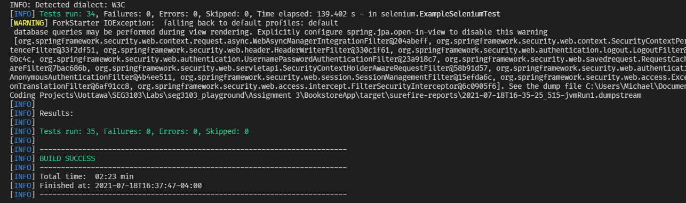

# Assignment 3

| Outline | Value |
| --- | --- |
| Course | SEG 3103 |
| Date | Summer 2021 |
| Name | Gabe Cordovado (300110852) and Michael Kagnew(300113347)  |
| Professor | Andrew Forward, aforward@uottawa.ca |

Repo link https://github.com/Michael-Kagnew/seg3103_playground

# Screenshot
