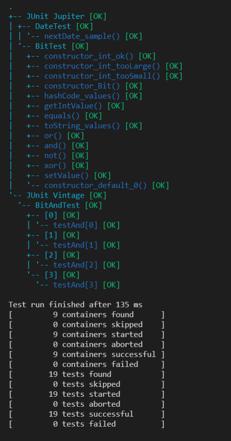
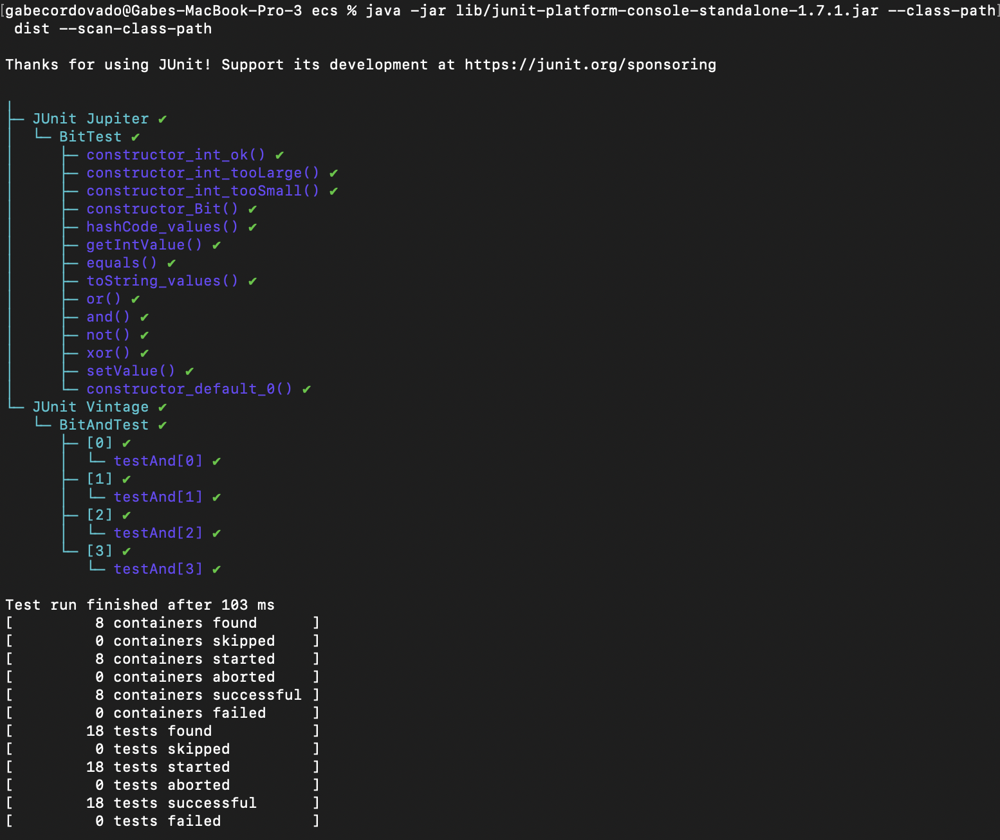
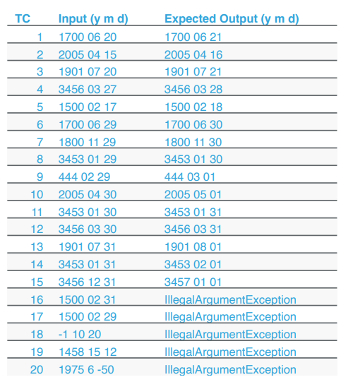

# Lab02
| Outline | Value |
| --- | --- |
| Course | SEG 3103 |
| Date | Summer 2021 |
| Name | Gabe Cordovado (300110852) and Michael Kagnew(300113347)  |
| Professor | Andrew Forward, aforward@uottawa.ca |
| TA | Henry Chen, zchen229@uottawa.ca |

Repo link https://github.com/Michael-Kagnew/seg3103_playground

# Exercise 1
Run the sample test cases created from the tutorial, and
report the results in the table below with the following
header

 Test Case | Expected Result | Actual Results | Verdict(Pass, Fail, Inconclusive) 
 --- | --- | --- | --- 
1 | registration request accepted |  registration request accepted        | Pass
2 |    registration request accepted   |  registration request accepted          | Pass
3 | registration request accepted |Err4: registration request accepted | Pass
4 |    registration request accepted   |      registration request accepted          | Pass
5 |    Err 1: Wrong UserName format   | Err1:Wrong UserName format, Err3: Size must be between 6 and 12          | Pass
6 | Err3: Size must be between 6 and 12 | Err1:Wrong UserName format, Err3: Size must be between 6 and 12 | Pass
7 | Err3:Size must be between 6 and 12  | Err3: Size must be between 6 and 12 | Pass
8 | Err1:Wrong UserName format | Err1:Wrong UserName format | Pass


## JUnit Paramaterized

Proof of compilation by Michael Kagnew:



Proof of compilation by Gabriel Cordavado:




## DATE nextdate method
The class Date (Data.java) provides a basic implementation
of a data structure for dates. Method nextDate returns an
instance of Date corresponding to the date of the day after
the executing instance.



# Exercise 2
Implement explicit tests using JUnit 5
‣ DateTest.java
‣ Implement Parameterized tests using JUnit 4 or 5. You will
need to create two Parameterized test suites:
‣ DateNextDateOkTest.java for test cases that run OK
and return a date
‣ DateNextDateExceptionTest.java for test cases that
DO result in an exception

```cmd

+-- JUnit Jupiter [OK]
| +-- DateTest [OK]
| | +-- nextDate_t1() [OK]
| | +-- nextDate_t2() [OK]
| | +-- nextDate_t3() [OK]
| | +-- nextDate_t4() [OK]
| | +-- nextDate_t5() [OK]
| | +-- nextDate_t6() [OK]
| | +-- nextDate_t7() [OK]
| | +-- nextDate_t8() [OK]
| | +-- nextDate_t9() [OK]
| | +-- nextDate_t10() [OK]
| | +-- nextDate_t11() [OK]
| | +-- nextDate_t12() [OK]
| | +-- nextDate_t13() [OK]
| | +-- nextDate_t14() [OK]
| | +-- nextDate_t15() [OK]
| | +-- nextDate_t16() [OK]
| | +-- nextDate_t17() [OK]
| | +-- nextDate_t18() [OK]
| | +-- nextDate_t19() [OK]
| | '-- nextDate_t20() [OK]
| '-- BitTest [OK]
|   +-- constructor_int_ok() [OK]
|   +-- constructor_int_tooLarge() [OK]
|   +-- constructor_int_tooSmall() [OK]
|   +-- constructor_Bit() [OK]
|   +-- hashCode_values() [OK]
|   +-- getIntValue() [OK]
|   +-- equals() [OK]
|   +-- toString_values() [OK]
|   +-- or() [OK]
|   +-- and() [OK]
|   +-- not() [OK]
|   +-- xor() [OK]
|   +-- setValue() [OK]
|   '-- constructor_default_0() [OK]
'-- JUnit Vintage [OK]
  +-- BitAndTest [OK]
  | +-- [0] [OK]
  | | '-- testAnd[0] [OK]
  | +-- [1] [OK]
  | | '-- testAnd[1] [OK]
  | +-- [2] [OK]
  | | '-- testAnd[2] [OK]
  | '-- [3] [OK]
  |   '-- testAnd[3] [OK]
  +-- DateNextDateOkTest [OK]
  | +-- [0] [OK]
  | | '-- testNextDateException[0] [OK]
  | +-- [1] [OK]
  | | '-- testNextDateException[1] [OK]
  | +-- [2] [OK]
  | | '-- testNextDateException[2] [OK]
  | +-- [3] [OK]
  | | '-- testNextDateException[3] [OK]
  | +-- [4] [OK]
  | | '-- testNextDateException[4] [OK]
  | +-- [5] [OK]
  | | '-- testNextDateException[5] [OK]
  | +-- [6] [OK]
  | | '-- testNextDateException[6] [OK]
  | +-- [7] [OK]
  | | '-- testNextDateException[7] [OK]
  | +-- [8] [OK]
  | | '-- testNextDateException[8] [OK]
  | +-- [9] [OK]
  | | '-- testNextDateException[9] [OK]
  | +-- [10] [OK]
  | | '-- testNextDateException[10] [OK]
  | +-- [11] [OK]
  | | '-- testNextDateException[11] [OK]
  | +-- [12] [OK]
  | | '-- testNextDateException[12] [OK]
  | +-- [13] [OK]
  | | '-- testNextDateException[13] [OK]
  | '-- [14] [OK]
  |   '-- testNextDateException[14] [OK]
  '-- DateNextDateExceptionTest [OK]
    +-- [0] [OK]
    | '-- testNextDateException[0] [OK]
    +-- [1] [OK]
    | '-- testNextDateException[1] [OK]
    +-- [2] [OK]
    | '-- testNextDateException[2] [OK]
    +-- [3] [OK]
    | '-- testNextDateException[3] [OK]
    '-- [4] [OK]
      '-- testNextDateException[4] [OK]

Test run finished after 153 ms
[        31 containers found      ]
[         0 containers skipped    ]
[        31 containers started    ]
[         0 containers aborted    ]
[        31 containers successful ]
[         0 containers failed     ]
[        58 tests found           ]
[         0 tests skipped         ]
[        58 tests started         ]
[         0 tests aborted         ]
[        58 tests successful      ]
[         0 tests failed          ]
```
