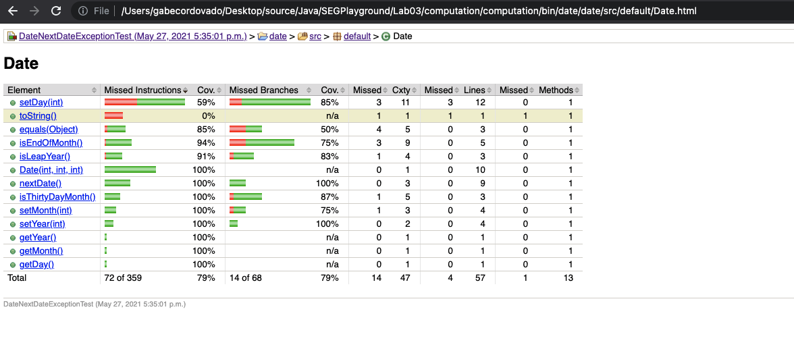

# Lab03
| Outline | Value |
| --- | --- |
| Course | SEG 3103 |
| Date | Summer 2021 |
| Name | Gabe Cordovado (300110852) and Michael Kagnew(300113347)  |
| Professor | Andrew Forward, aforward@uottawa.ca |
| TA | Henry Chen, n.bayati@uottawa.ca |

Repo link https://github.com/Michael-Kagnew/seg3103_playground

# Lab 3 Objectives
- Running code coverage tools
- Applying white-box coverage techniques 
- Refactoring in systematic steps 
- Continue practice of Git/GitHub

# Jacoco Coverage Analysis
Jacoco is a free code coverage library for Java, and during this lab, we utilized it in the Eclipse IDE. Below are the results for the computation test class, as well as screenshots for the Date class before and after adding test classes and refactoring.

## Computation Code Coverage Metrics

Here are the metrics for the computation code coverage:

## Date Code Coverage Metrics
Here are the metrics for the date class before any changes were made:

Here are the mertrics after adding in more tests:  SAME METRICS AFTER REFACTORING

## Manual Condition Coverage
After counting all the conditions, there are 27/28 conditions being covered, resulting in 96% condition coverage

## Discussion
For the Date class, we were able to bring up the code coverage from 79% to 98.5%. It was not possible to achieve 100% code coverage due to the condition below:

This single condition was not refactorable in order to effectively achieve complete coverage, therefore it's not always possible to achieve 100% code coverage. Our refactoring was limited, and did not change the function in a meaningful way, even after our best attempts to determine what could be done. It could be the software having problems, or a truly underlying logic issue that we missed, but my partner and I suspect Jacoco making some errors.

As mentioned, the refactoring was limited since every other part of the code was covered successfully, except for that single condition. Therefore, no changes were made. However, at 98.5% branch coverage, with many other coverages at 100%, we believe this number achieves a satisfactory amount of testing. 