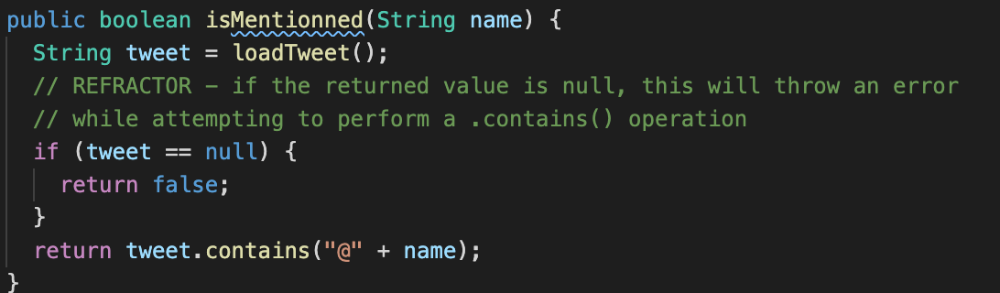

# Lab05
| Outline | Value |
| --- | --- |
| Course | SEG 3103 |
| Date | Summer 2021 |
| Name | Gabe Cordovado (300110852) and Michael Kagnew(300113347)  |
| Professor | Andrew Forward, aforward@uottawa.ca |
| TA | Henry Chen, zchen229@uottawa.ca|

Repo link https://github.com/Michael-Kagnew/seg3103_playground

# Grades

## Before Modification 
The git commit: 0f4794a0e1f9cf27f0eb1a866b5a059d074cc187

## Stub Code and Stub Results
Below is the stub code, and its commit is 87db0bea7eb826d157bdb30cc9909a82a4a8d859

Here are two pictures of the results when running the mocked code.

As seen, we are able to fake the 3 functions to work in order to be able to keep coding, even if the actual output is not accurate.

## Real Code Results

# Twitter

# Test isMentionned()

- isMentionned_lookForAtSymbol() is mocked in commit *effd62f2f3d727caaeacb6d85b91723d90f85e6a*
- isMentionned_dontReturnSubStringMatches() is mocked in commit *2924332d0692c78f7c04a1c2e2b22c565a88d2bd*
- isMentionned_superStringNotFound() is mocked in commit *029c5ff669530697391fa246ae074bf34379be4a*
- isMentionned_isMentionned_handleNull() is mocked in commit *18b18d6072a7582d9ecf5b2b5dcda840513527cc*

Here is the confirmation that after implementing each mock for the isMentionned(), it passes

# Refactor
We noticed that occasionally on loadTweet() returning a null value instead of a String, the function .contains() in isMentionned would throw an error, as we cannot compare a null/string value together. In order to avoid this we can place a conditional check that the returned value is not null, where in the case it is, returning false.

- this code is refactored in commit *7dc256fe843c3c08655fe514076f9d1e91da2a43*

