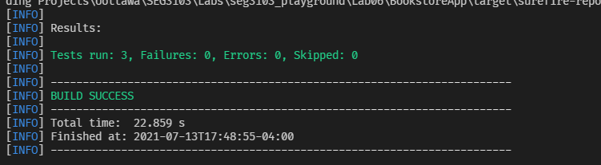

# Lab 6

| Outline | Value |
| --- | --- |
| Course | SEG 3103 |
| Date | Summer 2021 |
| Name | Gabe Cordovado (300110852) and Michael Kagnew(300113347)  |
| Professor | Andrew Forward, aforward@uottawa.ca |
| TA | Zahra Kakavand, zkaka044@uottawa.ca|

Repo link https://github.com/Michael-Kagnew/seg3103_playground

# Mvn --version output
```
Apache Maven 3.8.1 (05c21c65bdfed0f71a2f2ada8b84da59348c4c5d)
Maven home: C:\Users\Michael\apache-maven\bin\..
Java version: 11.0.11, vendor: Oracle Corporation, runtime: C:\Program Files\Java\jdk-11.0.11
Default locale: en_CA, platform encoding: Cp1252
OS name: "windows 10", version: "10.0", arch: "amd64", family: "windows"
```
# Mvn compile output
```
[INFO] Scanning for projects...
[INFO] 
[INFO] ------------------------< SEG3103:BookstoreApp >------------------------
[INFO] Building BookstoreApp 0.1.0
[INFO] --------------------------------[ jar ]---------------------------------
[INFO] 
[INFO] --- maven-resources-plugin:2.6:resources (default-resources) @ BookstoreApp ---
[INFO] Using 'UTF-8' encoding to copy filtered resources.
[INFO] skip non existing resourceDirectory C:\Users\Michael\Documents\Coding Projects\Uottawa\SEG3103\Labs\seg3103_playground\Lab06\BookstoreApp\src\main\resources
[INFO]
[INFO] --- maven-compiler-plugin:3.7.0:compile (default-compile) @ BookstoreApp ---
[INFO] Nothing to compile - all classes are up to date
[INFO] ------------------------------------------------------------------------
[INFO] BUILD SUCCESS
[INFO] ------------------------------------------------------------------------
[INFO] Total time:  2.049 s
[INFO] Finished at: 2021-07-13T17:19:19-04:00
[INFO] ------------------------------------------------------------------------
```
# mvn package -DskipTests output
```
[INFO] Scanning for projects...
[INFO] 
[INFO] ------------------------< SEG3103:BookstoreApp >------------------------
[INFO] Building BookstoreApp 0.1.0
[INFO] --------------------------------[ jar ]---------------------------------
[INFO] 
[INFO] --- maven-resources-plugin:2.6:resources (default-resources) @ BookstoreApp ---
[INFO] Using 'UTF-8' encoding to copy filtered resources.
[INFO] skip non existing resourceDirectory C:\Users\Michael\Documents\Coding Projects\Uottawa\SEG3103\Labs\seg3103_playground\Lab06\BookstoreApp\src\main\resources
[INFO]
[INFO] --- maven-compiler-plugin:3.7.0:compile (default-compile) @ BookstoreApp ---
[INFO] Nothing to compile - all classes are up to date
[INFO]
[INFO] --- maven-resources-plugin:2.6:testResources (default-testResources) @ BookstoreApp ---
[INFO] Using 'UTF-8' encoding to copy filtered resources.
[INFO] skip non existing resourceDirectory C:\Users\Michael\Documents\Coding Projects\Uottawa\SEG3103\Labs\seg3103_playground\Lab06\BookstoreApp\src\test\resources
[INFO]
[INFO] --- maven-compiler-plugin:3.7.0:testCompile (default-testCompile) @ BookstoreApp ---
[INFO] Nothing to compile - all classes are up to date
[INFO]
[INFO] --- maven-surefire-plugin:2.22.1:test (default-test) @ BookstoreApp ---
[INFO] Tests are skipped.
[INFO]
[INFO] --- maven-jar-plugin:2.4:jar (default-jar) @ BookstoreApp ---
[INFO] 
[INFO] --- maven-assembly-plugin:2.2-beta-5:single (make-assembly) @ BookstoreApp ---

...Lots of skipped lines here

[WARNING] Configuration options: 'appendAssemblyId' is set to false, and 'classifier' is missing.
Instead of attaching the assembly file: C:\Users\Michael\Documents\Coding Projects\Uottawa\SEG3103\Labs\seg3103_playground\Lab06\BookstoreApp\target\BookstoreApp-0.1.0.jar, it will become the file for main project artifact.
NOTE: If multiple descriptors or descriptor-formats are provided for this project, the value of this file will be non-deterministic!
[WARNING] Replacing pre-existing project main-artifact file: C:\Users\Michael\Documents\Coding Projects\Uottawa\SEG3103\Labs\seg3103_playground\Lab06\BookstoreApp\target\BookstoreApp-0.1.0.jar
with assembly file: C:\Users\Michael\Documents\Coding Projects\Uottawa\SEG3103\Labs\seg3103_playground\Lab06\BookstoreApp\target\BookstoreApp-0.1.0.jar
[INFO] ------------------------------------------------------------------------
[INFO] BUILD SUCCESS
[INFO] ------------------------------------------------------------------------
[INFO] Total time:  21.458 s
[INFO] Finished at: 2021-07-13T17:26:32-04:00
[INFO] ------------------------------------------------------------------------
```

This command compiles the latest file changes and packages into an execuable based off settings in the pom.xml file.

# java -jar ./target/BookstoreApp-0.1.0.jar Output
```
Press Enter to stop server
```
# Mvn test Output



# Screenshot of added test


# App Running Screenshot

Below is the app running when executing the BookStoreApp-0.1.0.jar file in the target directory


# Tests Running with New Test
The below screenshot is the output of the 3 tests that exist, plus one extra one we created.

