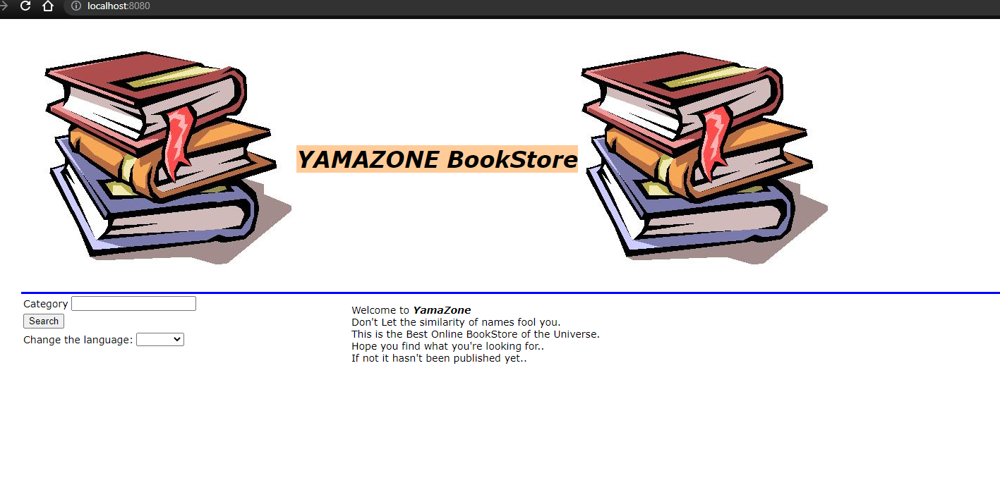

# Lab 6

| Outline | Value |
| --- | --- |
| Course | SEG 3103 |
| Date | Summer 2021 |
| Name | Gabe Cordovado (300110852) and Michael Kagnew(300113347)  |
| Professor | Andrew Forward, aforward@uottawa.ca |
| TA | Zahra Kakavand, zkaka044@uottawa.ca|

Repo link https://github.com/Michael-Kagnew/seg3103_playground

# App Running Screenshot

Below is the app running when executing the BookStoreApp-0.1.0.jar file in the target directory

# Tests Running
The below screenshot is the output of the 3 tests that exist, plus one extra one we created.