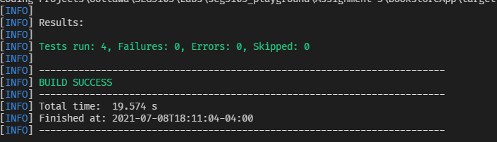

# Lab 6

| Outline | Value |
| --- | --- |
| Course | SEG 3103 |
| Date | Summer 2021 |
| Name | Gabe Cordovado (300110852) and Michael Kagnew(300113347)  |
| Professor | Andrew Forward, aforward@uottawa.ca |
| TA | Zahra Kakavand, zkaka044@uottawa.ca|

Repo link https://github.com/Michael-Kagnew/seg3103_playground

# Mvn --version output
```
Apache Maven 3.8.1 (05c21c65bdfed0f71a2f2ada8b84da59348c4c5d)
Maven home: C:\Users\Michael\apache-maven\bin\..
Java version: 11.0.11, vendor: Oracle Corporation, runtime: C:\Program Files\Java\jdk-11.0.11
Default locale: en_CA, platform encoding: Cp1252
OS name: "windows 10", version: "10.0", arch: "amd64", family: "windows"
```
# Mvn compile output
```
[INFO] Scanning for projects...
[INFO] 
[INFO] ------------------------< SEG3103:BookstoreApp >------------------------
[INFO] Building BookstoreApp 0.1.0
[INFO] --------------------------------[ jar ]---------------------------------
[INFO] 
[INFO] --- maven-resources-plugin:2.6:resources (default-resources) @ BookstoreApp ---
[INFO] Using 'UTF-8' encoding to copy filtered resources.
[INFO] skip non existing resourceDirectory C:\Users\Michael\Documents\Coding Projects\Uottawa\SEG3103\Labs\seg3103_playground\Lab06\BookstoreApp\src\main\resources
[INFO]
[INFO] --- maven-compiler-plugin:3.7.0:compile (default-compile) @ BookstoreApp ---
[INFO] Nothing to compile - all classes are up to date
[INFO] ------------------------------------------------------------------------
[INFO] BUILD SUCCESS
[INFO] ------------------------------------------------------------------------
[INFO] Total time:  2.049 s
[INFO] Finished at: 2021-07-13T17:19:19-04:00
[INFO] ------------------------------------------------------------------------
```
# mvn package -DskipTests output
```
[INFO] Scanning for projects...
[INFO] 
[INFO] ------------------------< SEG3103:BookstoreApp >------------------------
[INFO] Building BookstoreApp 0.1.0
[INFO] --------------------------------[ jar ]---------------------------------
[INFO] 
[INFO] --- maven-resources-plugin:2.6:resources (default-resources) @ BookstoreApp ---
[INFO] Using 'UTF-8' encoding to copy filtered resources.
[INFO] skip non existing resourceDirectory C:\Users\Michael\Documents\Coding Projects\Uottawa\SEG3103\Labs\seg3103_playground\Lab06\BookstoreApp\src\main\resources
[INFO]
[INFO] --- maven-compiler-plugin:3.7.0:compile (default-compile) @ BookstoreApp ---
[INFO] Nothing to compile - all classes are up to date
[INFO]
[INFO] --- maven-resources-plugin:2.6:testResources (default-testResources) @ BookstoreApp ---
[INFO] Using 'UTF-8' encoding to copy filtered resources.
[INFO] skip non existing resourceDirectory C:\Users\Michael\Documents\Coding Projects\Uottawa\SEG3103\Labs\seg3103_playground\Lab06\BookstoreApp\src\test\resources
[INFO]
[INFO] --- maven-compiler-plugin:3.7.0:testCompile (default-testCompile) @ BookstoreApp ---
[INFO] Nothing to compile - all classes are up to date
[INFO]
[INFO] --- maven-surefire-plugin:2.22.1:test (default-test) @ BookstoreApp ---
[INFO] Tests are skipped.
[INFO]
[INFO] --- maven-jar-plugin:2.4:jar (default-jar) @ BookstoreApp ---
[INFO] 
[INFO] --- maven-assembly-plugin:2.2-beta-5:single (make-assembly) @ BookstoreApp ---

...Lots of skipped lines here

[WARNING] Configuration options: 'appendAssemblyId' is set to false, and 'classifier' is missing.
Instead of attaching the assembly file: C:\Users\Michael\Documents\Coding Projects\Uottawa\SEG3103\Labs\seg3103_playground\Lab06\BookstoreApp\target\BookstoreApp-0.1.0.jar, it will become the file for main project artifact.
NOTE: If multiple descriptors or descriptor-formats are provided for this project, the value of this file will be non-deterministic!
[WARNING] Replacing pre-existing project main-artifact file: C:\Users\Michael\Documents\Coding Projects\Uottawa\SEG3103\Labs\seg3103_playground\Lab06\BookstoreApp\target\BookstoreApp-0.1.0.jar
with assembly file: C:\Users\Michael\Documents\Coding Projects\Uottawa\SEG3103\Labs\seg3103_playground\Lab06\BookstoreApp\target\BookstoreApp-0.1.0.jar
[INFO] ------------------------------------------------------------------------
[INFO] BUILD SUCCESS
[INFO] ------------------------------------------------------------------------
[INFO] Total time:  21.458 s
[INFO] Finished at: 2021-07-13T17:26:32-04:00
[INFO] ------------------------------------------------------------------------
```

This command compiles the latest file changes and packages into an execuable based off settings in the pom.xml file.

# java -jar ./target/BookstoreApp-0.1.0.jar Output
```
Press Enter to stop server
```
# Mvn test Output
```
[INFO] Scanning for projects...
[INFO]
[INFO] ------------------------< SEG3103:BookstoreApp >------------------------
[INFO] Building BookstoreApp 0.1.0
[INFO] --------------------------------[ jar ]---------------------------------
[INFO]
[INFO] --- maven-resources-plugin:2.6:resources (default-resources) @ BookstoreApp ---
[INFO] Using 'UTF-8' encoding to copy filtered resources.    
[INFO] skip non existing resourceDirectory C:\Users\Michael\Documents\Coding Projects\Uottawa\SEG3103\Labs\seg3103_playground\Lab06\BookstoreApp\src\main\resources
[INFO]
[INFO] --- maven-compiler-plugin:3.7.0:compile (default-compile) @ BookstoreApp ---
[INFO] Changes detected - recompiling the module!
[INFO] Compiling 1 source file to C:\Users\Michael\Documents\Coding Projects\Uottawa\SEG3103\Labs\seg3103_playground\Lab06\BookstoreApp\target\classes
[INFO]
[INFO] --- maven-resources-plugin:2.6:testResources (default-testResources) @ BookstoreApp ---
[INFO] Using 'UTF-8' encoding to copy filtered resources.
[INFO] skip non existing resourceDirectory C:\Users\Michael\Documents\Coding Projects\Uottawa\SEG3103\Labs\seg3103_playground\Lab06\BookstoreApp\src\test\resources
[INFO]
[INFO] --- maven-compiler-plugin:3.7.0:testCompile (default-testCompile) @ BookstoreApp ---
[INFO] Changes detected - recompiling the module!
[INFO] Compiling 2 source files to C:\Users\Michael\Documents\Coding Projects\Uottawa\SEG3103\Labs\seg3103_playground\Lab06\BookstoreApp\target\test-classes
[INFO] 
[INFO] --- maven-surefire-plugin:2.22.1:test (default-test) @ BookstoreApp ---
[INFO] 
[INFO] -------------------------------------------------------
[INFO]  T E S T S
[INFO] -------------------------------------------------------
[INFO] Running ExampleTest
[INFO] Tests run: 1, Failures: 0, Errors: 0, Skipped: 0, Time elapsed: 0.058 s - in ExampleTest
[INFO] Running selenium.ExampleSeleniumTest
SLF4J: Failed to load class "org.slf4j.impl.StaticLoggerBinder".
SLF4J: Defaulting to no-operation (NOP) logger implementation
SLF4J: See http://www.slf4j.org/codes.html#StaticLoggerBinder for further details.
Starting ChromeDriver 91.0.4472.101 (af52a90bf87030dd1523486a1cd3ae25c5d76c9b-refs/branch-heads/4472@{#1462}) on port 31434
Only local connections are allowed.
Please see https://chromedriver.chromium.org/security-considerations for suggestions on keeping ChromeDriver safe.
ChromeDriver was started successfully.
[WARNING] Corrupted STDOUT by directly writing to native stream in forked JVM 1. See FAQ web page and the dump file C:\Users\Michael\Documents\Coding Projects\Uottawa\SEG3103\Labs\seg3103_playground\Lab06\BookstoreApp\target\surefire-reports\2021-07-13T17-40-24_952-jvmRun1.dumpstream
Jul. 13, 2021 5:40:30 P.M. org.openqa.selenium.remote.ProtocolHandshake createSession
INFO: Detected dialect: W3C
Starting ChromeDriver 91.0.4472.101 (af52a90bf87030dd1523486a1cd3ae25c5d76c9b-refs/branch-heads/4472@{#1462}) on port 7773
Only local connections are allowed.
Please see https://chromedriver.chromium.org/security-considerations for suggestions on keeping ChromeDriver safe.
ChromeDriver was started successfully.
Jul. 13, 2021 5:40:41 P.M. org.openqa.selenium.remote.ProtocolHandshake createSession
INFO: Detected dialect: W3C
Starting ChromeDriver 91.0.4472.101 (af52a90bf87030dd1523486a1cd3ae25c5d76c9b-refs/branch-heads/4472@{#1462}) on port 25890
Only local connections are allowed.
Please see https://chromedriver.chromium.org/security-considerations for suggestions on keeping ChromeDriver safe.
ChromeDriver was started successfully.
Jul. 13, 2021 5:40:44 P.M. org.openqa.selenium.remote.ProtocolHandshake createSession
INFO: Detected dialect: W3C
[INFO] Tests run: 3, Failures: 0, Errors: 0, Skipped: 0, Time elapsed: 19.34 s - in selenium.ExampleSeleniumTest
[WARNING] ForkStarter IOException:  falling back to default profiles: default
 database queries may be performed during view rendering. Explicitly configure spring.jpa.open-in-view to disable this warning
 [org.springframework.security.web.context.request.async.WebAsyncManagerIntegrationFilter@2596d7f4, org.springframework.security.web.context.SecurityContextPersistenceFilter@77ab22be, org.springframework.security.web.header.HeaderWriterFilter@5a034157, org.springframework.security.web.authentication.logout.LogoutFilter@44af588b, org.springframework.security.web.authentication.UsernamePasswordAuthenticationFilter@6fc1020a, org.springframework.security.web.savedrequest.RequestCacheAwareFilter@1b6924cb, org.springframework.security.web.servletapi.SecurityContextHolderAwareRequestFilter@3ebe4ccc, org.springframework.security.web.authentication.AnonymousAuthenticationFilter@42a0501e, org.springframework.security.web.session.SessionManagementFilter@1391af3b, org.springframework.security.web.access.ExceptionTranslationFilter@4b4ee511, org.springframework.security.web.access.intercept.FilterSecurityInterceptor@73ae0257]. See the dump file C:\Users\Michael\Documents\Coding Projects\Uottawa\SEG3103\Labs\seg3103_playground\Lab06\BookstoreApp\target\surefire-reports\2021-07-13T17-40-24_952-jvmRun1.dumpstream
[INFO] 
[INFO] Results:
[INFO]
[INFO] Tests run: 4, Failures: 0, Errors: 0, Skipped: 0
[INFO] 
[INFO] ------------------------------------------------------------------------
[INFO] BUILD SUCCESS
[INFO] ------------------------------------------------------------------------
[INFO] Total time:  25.919 s
[INFO] Finished at: 2021-07-13T17:40:46-04:00
[INFO] ------------------------------------------------------------------------
```

# Screenshot of added test


# App Running Screenshot

Below is the app running when executing the BookStoreApp-0.1.0.jar file in the target directory


# Tests Running
The below screenshot is the output of the 3 tests that exist, plus one extra one we created.

