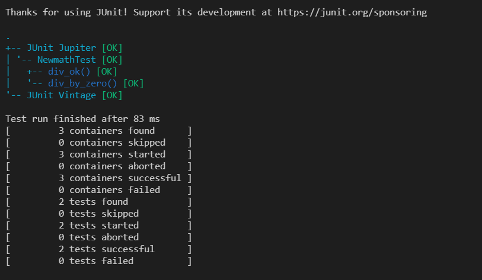
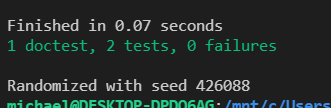

## Lab01
| Outline | Value |
| --- | --- |
| Course | SEG 3103 |
| Date | Summer 2021 |
| Name | Michael Kagnew, 300113347 |
| Professor | Andrew Forward, aforward@uottawa.ca |
| TA | Zahra Kakavand, jamesurl@uottawa.caa |

## Deliverables
- https://github.com/Michael-Kagnew/seg3103_playground
## Java
I am running Java 1.11
```java --version
java 11.0.11 2021-04-20 LTS
Java(TM) SE Runtime Environment 18.9 (build 11.0.11+9-LTS-194)
Java HotSpot(TM) 64-Bit Server VM 18.9 (build 11.0.11+9-LTS-194, mixed mode)
```
Since I am on Windows, I compile Java using
```
javac -encoding UTF-8 --source-path src -d dist src\*.java
```

Then I compile the tests doing the following code, changed so it works on Windows by using semi-colon.
```
javac -encoding UTF-8 --source-path test\ -d dist\ -cp dist;lib\junit-platform-console-standalone-1.7.1.jar test\*.java
```

I can then run the test using the following. I had to change the code in the bin folder in order for the tests to work on Windows
```
java -jar lib\junit-platform-console-standalone-1.7.1.jar --classpath dist --scan-classpath
```
The results are as follows:



## Elixir
For Elixir, I have a WSL set up with Ubuntu distro. To run the test, I execute this code in the project directory:
```
mix test test/ newmath_ex_test.exs
```
The output is the following:

